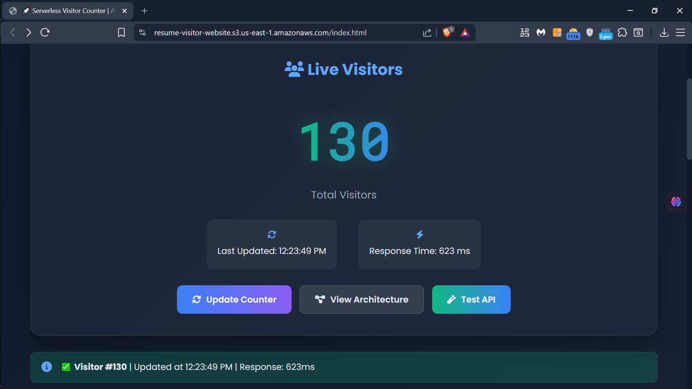
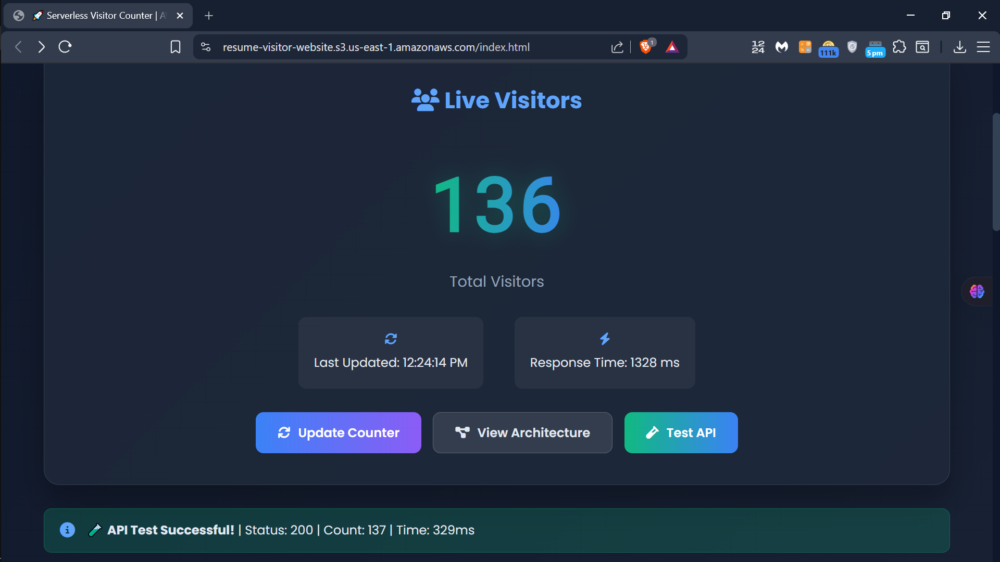
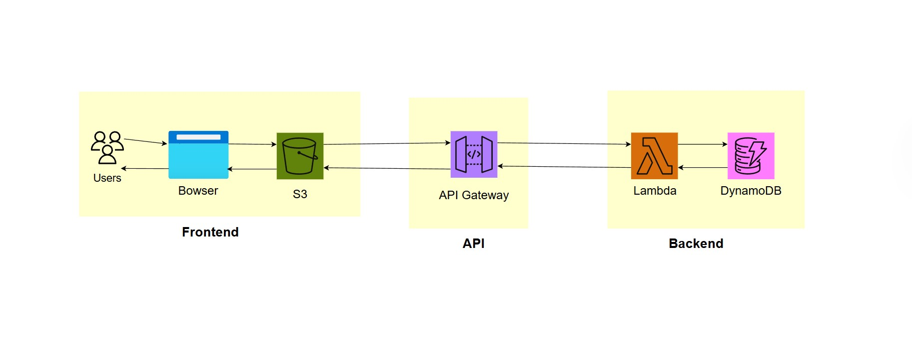
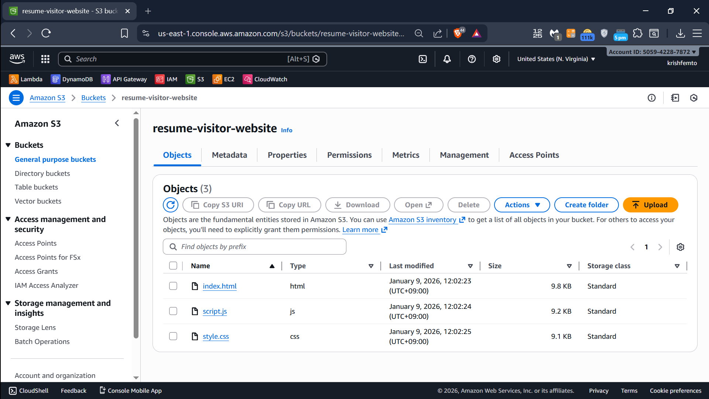
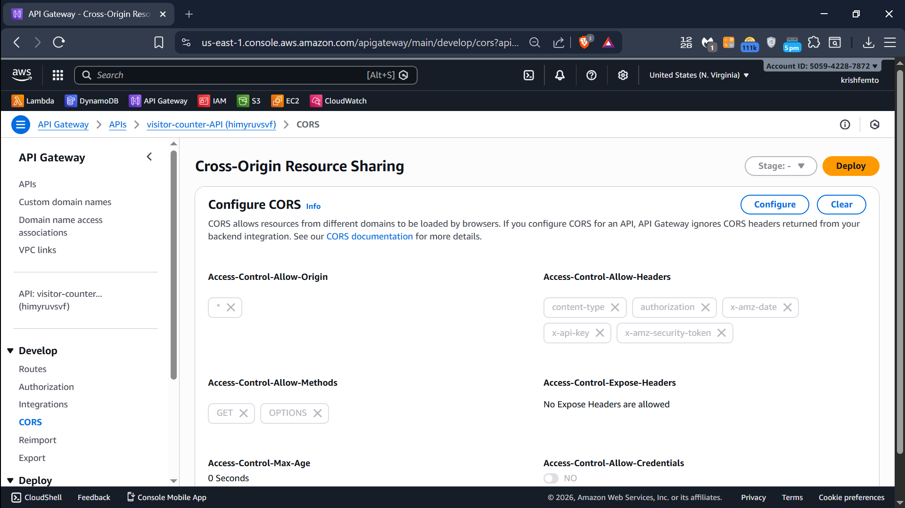
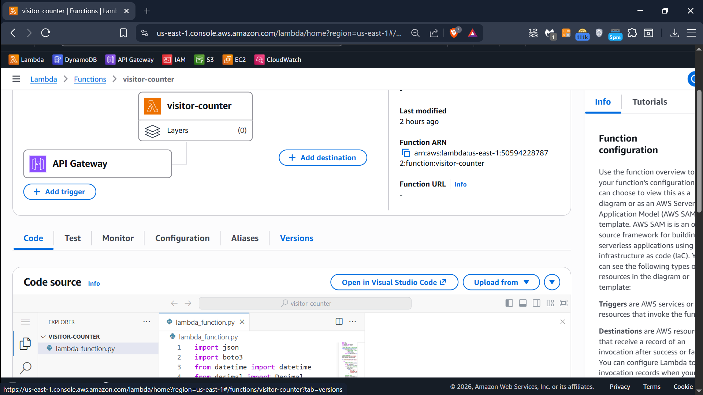
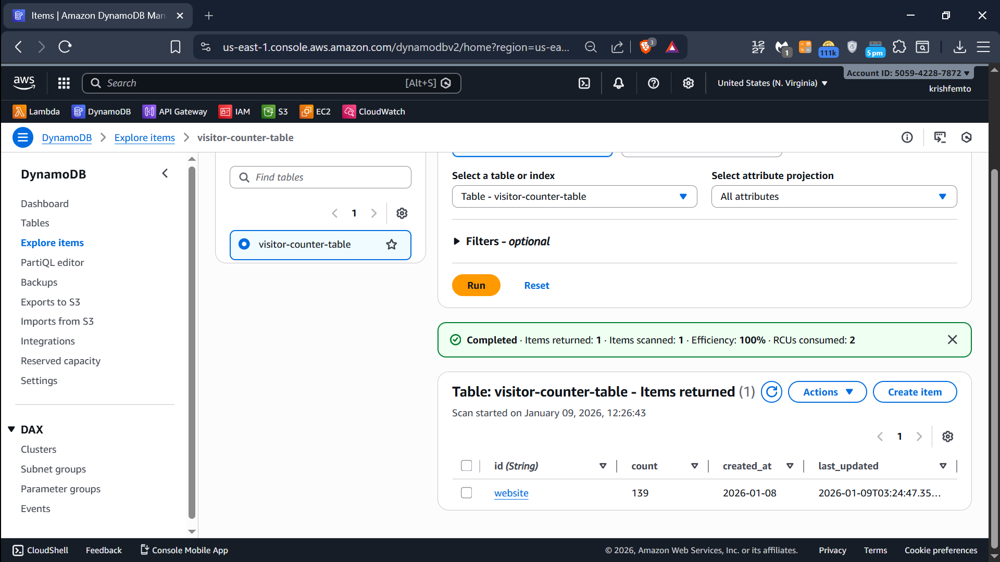

# ライブ訪問者カウンター 🌐👥

AWSサーバーレス技術で構築された、リアルタイムで現在のウェブサイト訪問者数を表示するカウンターです。サーバー管理不要、自動スケーリング、ほぼ無料で運用できます。

## ✨ デモ
[**👉 ライブデモはこちら**](https://resume-visitor-website.s3.us-east-1.amazonaws.com/index.html)

## 📸 画面イメージ

### メインダッシュボード

### ライブカウント動作中

## 🏗️ 仕組み（簡単に説明）

1. **あなたがウェブサイトを開く** → S3バケットでホストされたサイト
2. **ブラウザがAPIを呼び出す** → API Gatewayへリクエスト
3. **Lambda関数が起動** → 訪問者数を更新
4. **DynamoDBが数値を保存** → 高速で信頼性の高い保存
5. **ウェブサイトがリアルタイム更新** → 新しいカウントを表示

サーバーなし、手間なし。訪問者が来た時にだけコードが実行されます。

## 🧩 使用技術

| コンポーネント | 役割 | 画像 |
|---------------|------|------|
| **S3** | ウェブサイトファイル（HTML、CSS、JS）をホスト |  |
| **API Gateway** | 訪問者カウントAPIのエントリーポイント |  |
| **Lambda** | 訪問者数を更新するサーバーレス関数 |  |
| **DynamoDB** | 現在の訪問者数を保存するデータベース |  |

## 🚀 始め方

自分でデプロイしたいですか？

### 必要なもの：
- AWSアカウント（無料枠でOK）
- ウェブサイトファイル（HTML/CSS/JS）

### デプロイ手順（AWSコンソール使用）：
1. **S3バケットを作成** → ウェブサイトファイルをアップロード →「静的ウェブサイトホスティング」を有効化
2. **DynamoDBテーブルを作成** → `VisitorCounter`という名前で、`id`を主キーに設定
3. **Lambda関数を作成** → Node.jsまたはPythonでカウンターコードを実装
4. **API Gatewayを作成** → Lambda関数と連携
5. **ウェブサイトのJavaScriptを更新** → API GatewayのエンドポイントURLを設定
6. **S3ウェブサイトURLを開く** → カウンターをテスト！

## 💡 サーバーレスのメリット

- **アクセスがない時は料金が発生しない**
- **トラフィック増加に自動対応**
- **サーバー管理が不要**
- **AWSの信頼性で高速動作**

個人サイト、サイドプロジェクト、予測不可能なトラフィックに最適です。

## 🐛 バグ発見・機能提案

Issueを開くか、プルリクエストを送信してください。改善提案歓迎します！

---

AWSと少しの魔法で構築されました。✨
